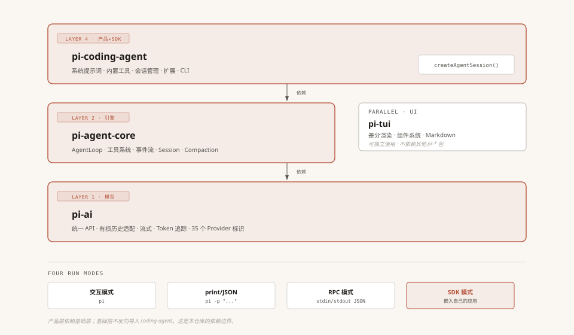

# 第1章：开篇 —— 为什么 Pi-Agent 值得你花时间

> **Python 阅读说明**：本版与 TypeScript 版共享同一份事实与正文结构。下列 Python 代码只用于解释 TypeScript 源码的控制流，并非可安装的 Pi Python SDK；字段名和类型以链接的 v0.80.2 TypeScript 源码为准。

> 本文是「Pi-Agent 项目原理详解」的开篇。不涉及源码细节，而是回答一个更根本的问题：Pi 是什么？它为什么值得你花时间？读完这篇，你会对 Pi 的三个身份——**编码工具、学习教材、开发 SDK**——有一个清晰的全局认知。
>
> **校对口径**：本章只描述 Pi **v0.80.2**（发布提交 [`0201806`](https://github.com/earendil-works/pi/tree/0201806adfa825ab3d7957a4267d46e5030fd357)）。可直接从源码验证的内容称为“实现”；体验判断和类比只用于帮助理解，不代表项目的官方承诺。

---

## 一、开场：三个问题，一个答案

你可能因为三种不同的原因点开了这个系列：

1. **"我想找个好用的编码 Agent"** — 你受够了臃肿的工具，想要一个极简、透明、快的东西
2. **"我想知道 Agent 到底怎么做的"** — 你翻过一些 Agent 框架的源码，要么太复杂（几万行起跳），要么太简陋（一个 while 循环就敢叫 Agent）
3. **"我要做自己的 Agent"** — 你有垂直场景的需求，需要基于 SDK 做二次开发，不想从零造轮子

这三个问题，恰好对应 Pi 的三个身份。而这三个身份指向同一个项目，这本身就值得好奇。

在深入源码之前，我们先站远一点，看看 Pi 的全貌。

---

## 二、Pi 是什么：一张图看懂

### 一句话定义

**Pi 是一款极简、可扩展的终端编码 Agent 外壳（coding agent harness），由 libGDX 作者 Mario Zechner 创建；四个核心包的主要实现使用 TypeScript，并以 MIT 协议开源。**

拆开来看：

- **"编码 Agent"** — 它能读懂你的代码库，写代码、改代码、跑命令，像一个坐在你旁边的结对编程伙伴
- **"终端外壳"** — 它住在终端里，没有 GUI，没有 IDE 插件，输出写进终端回滚缓冲区。这决定了它的一切后续设计选择
- **"极简"** — 默认 coding 工具围绕 read / write / edit / bash 组织，并提供 grep / find / ls 这一组只读探索工具。MCP、子 Agent、计划模式和审批流程不属于 v0.80.2 的默认内核；需要时可在产品边界之外组合或扩展
- **"可扩展"** — 极简核心之上的缺失功能，通过 TypeScript 扩展、技能、Pi Package 来补充

### v0.80.2 的可验证边界

| 观察面 | v0.80.2 源码中的事实 | 阅读时应如何理解 |
|--------|----------------------|------------------|
| 核心包 / root workspace | `packages/*` 匹配 ai / agent / coding-agent / tui 这 4 个顶层核心包；根配置另列 5 个扩展示例，共 9 个 workspace | 本章聚焦四个核心包；真实 DAG 是 coding-agent → agent-core / ai / tui，agent-core → ai |
| 内置 coding 工具 | read / bash / edit / write / grep / find / ls，共 7 个定义 | “4 个核心工具”是产品叙述，不等于源码里只有 4 个工具 |
| Provider 标识 | `KnownProvider` 联合类型列出 35 个标识，含区域和产品变体 | 不能把 35 直接当成 35 家独立公司 |
| 思考级别 | `ThinkingLevel` 有 5 级；加上 `off` 后，模型可选状态共 6 个 | 第 4 章会区分这两个类型 |
| 对外形态 | 交互、print、RPC，以及可嵌入的 SDK API | “运行模式”和“包的复用层级”是两个维度 |

### 四个核心包，各司其职

```
┌────────────────────────────────────────────────────┐
│              pi-coding-agent / CLI + SDK           │
└───────────────────────────┬────────────────────────┘
                            │ 直接依赖
          ┌─────────────────┼─────────────────┐
          │                 │                 │
          ▼                 ▼                 ▼
   ┌────────────┐   ┌───────────────┐   ┌───────────┐
   │   pi-tui   │   │ pi-agent-core │   │   pi-ai   │
   │Terminal UI │   │ Agent runtime │   │  LLM API  │
   └────────────┘   └───────┬───────┘   └─────▲─────┘
                            │                 │
                            └─────────────────┘
                              直接依赖 pi-ai
```

这四个包可以按“模型 → Agent 运行时 → coding 产品”理解为一条**三层能力堆栈**，但这不是完整的安装依赖图：`pi-coding-agent` 会直接导入 `pi-agent-core`、`pi-ai` 和 `pi-tui`，`pi-agent-core` 也会直接导入 `pi-ai`。`pi-tui` 自身不依赖其他 pi-* 包，可以独立使用；coding-agent 则不只在交互界面里使用它，也会复用其中的终端渲染与格式化能力。你仍然可以只用 `pi-ai` 调模型，或用 `pi-agent-core` 构建不带 CLI 的 Agent。



**配图说明**：四个核心包的真实依赖 DAG。coding-agent 直接指向 agent-core、pi-ai 和 pi-tui，agent-core 再指向 pi-ai；pi-tui 与 pi-ai 自身都不依赖其他 pi-* 包。底部的四项是产品对外使用形态，不是包层号。

---

## 三、视角一：作为编码 Agent —— 一个好用的日常工具

先聊最实际的：把它当工具用，体验怎么样？

### 3.1 按需装配上下文

Pi 的系统提示词由一份较短的静态骨架和运行时内容共同组成：所选工具、技能索引、项目上下文文件都会改变最终请求大小。因此不能用一个固定 token 数概括所有会话；真正值得关注的是它把可选信息按需装配，而不是默认把所有能力说明一次性塞进提示词。

**为什么这件事重要？** 上下文窗口是 Agent 最稀缺的资源。固定指令占得越少，留给代码和项目上下文的空间就越多。Pi 的提示词来源也可以从源码、配置和启动界面检查：项目级 `.pi/SYSTEM.md` 或全局 `~/.pi/agent/SYSTEM.md` 可以替换默认提示词骨架，`APPEND_SYSTEM.md` 则用于追加内容。上下文文件与技能索引仍是独立装配的输入，所以“替换默认骨架”不等于最终请求里只剩这一份文件。

技能（Skills）采用**渐进式披露**：启动时扫描技能并把名称、描述放进系统提示词；完整 `SKILL.md` 只在模型读取或用户调用 `/skill:name` 时进入上下文。也就是说，技能不是“零预加载”，而是只常驻一份轻量索引。

### 3.2 透明到骨头里

Pi 的交互界面会展示模型回复与工具调用过程，会话也能导出为 HTML。这里的“透明”仍有边界：Provider 服务端如何处理请求、模型内部如何推理，并不会因为客户端开源而变得可见。

这有什么用？当 Agent 做出奇怪决定时，你至少可以检查客户端装配了哪些提示、消息和工具结果，而不必只看最后答案。不过，这仍不能解释模型内部为什么生成某个 token。

### 3.3 模型自由

Pi v0.80.2 的 `KnownProvider` 联合类型列出 35 个标识，包括区域、产品和兼容端点变体；它们不能直接换算成 35 家公司。覆盖的内置生态包括 Anthropic、OpenAI、Google、Azure、Bedrock、Mistral、Groq、Cerebras、xAI、Hugging Face、Kimi、MiniMax、OpenRouter、DeepSeek、智谱、小米、Together 和 Fireworks 等。Ollama 不在这 35 个内置标识里，而是通过兼容 OpenAI 协议的自定义端点接入，见 3.7 节。

你可以在**会话中途**用 `/model` 或 `Ctrl+L` 切换模型。切换后，既有历史会由新模型对应的适配器重新序列化；无法跨协议复用的供应商字段可能被转换或省略。因此这是一种保留可用历史的有损交接，不应理解为不同供应商之间可以无损回放全部内部状态。

### 3.4 树状会话：走错路了就分叉

Pi 把会话组织成一棵**有根树**，而不是只保留当前路径的线性日志。用 `/tree` 跳到历史节点，再追加消息时就会形成新分支。旧分支仍保留在同一个会话文件中。

这在调试时尤其有用——你可以在同一个起点尝试三种不同的修复方案，而不必担心"回不去了"。

### 3.5 默认执行权限与安全边界

Pi 没有内置的逐命令审批弹窗或沙箱。内置工具和扩展都以启动 `pi` 的用户权限运行；项目 trust 控制是否加载项目级设置、受保护的 `.pi` 资源、项目包和扩展，不会限制模型之后能让工具做什么。`AGENTS.md` 和 `CLAUDE.md` 上下文文件是例外：除非关闭上下文加载，否则无论项目是否受信任都会读取。

这意味着安全责任落在运行环境和使用者身上。v0.80.2 的安全文档建议：处理不可信仓库、无人值守任务或不便逐步监督的生成代码时，把整个进程放进容器、虚拟机或策略沙箱，并只暴露必要的文件和凭据。如果工作流确实需要确认步骤，可以通过 `tool_call` 扩展钩子实现；仓库也提供了 `permission-gate.ts` 示例，但它仍是应用层策略，不等于操作系统隔离。

### 3.6 上手一分钟

Pi v0.80.2 要求 Node.js **22.19.0 或更高版本**。满足此前提后安装：

```bash
npm install -g --ignore-scripts @earendil-works/pi-coding-agent@0.80.2
```

然后在任意项目目录里运行 `pi`。设置受支持 Provider 的 API Key，或者用 `/login` 完成相应认证，就可以开始。上面的版本号是为了与本教程源码一致；官方安装脚本和不带版本号的 npm 命令会安装当时的最新版本，其行为可能已经不同。

### 3.7 用 `models.json` 定义自定义端点与模型

内置 Provider 可以通过登录信息或相应环境变量认证；如果要增加自定义端点、代理或注册表里没有的模型，则还需要告诉 Pi：base URL 在哪、使用哪种 API 协议、模型 ID 是什么。

Pi 的解法是一个本地 JSON 配置文件：`~/.pi/agent/models.json`（Windows 下是 `C:\Users\<你>\.pi\agent\models.json`）。模型注册表会读取这份配置；`/model` 打开时还会重新加载，因此编辑后不必重启。实现见 [`model-registry.ts`](https://github.com/earendil-works/pi/blob/0201806adfa825ab3d7957a4267d46e5030fd357/packages/coding-agent/src/core/model-registry.ts)。

下面采用 v0.80.2 自带文档中的 Ollama 最小配置，避免把尚未存在或参数未经验证的云端模型写成“真实例子”：

```json
{
  "providers": {
    "ollama": {
      "baseUrl": "http://localhost:11434/v1",
      "api": "openai-completions",
      "apiKey": "ollama",
      "models": [
        { "id": "llama3.1:8b" },
        { "id": "qwen2.5-coder:7b" }
      ]
    }
  }
}
```

拆开看几个关键字段：

- **`providers`** — 顶层是 provider 字典，键名（这里是 `ollama`）是配置中的 provider id
- **`api`** — 选协议，例如 `openai-completions`、`anthropic-messages` 或 `openai-responses`。这个字段决定 Pi 使用哪一种请求格式；端点究竟兼容哪种协议，应以服务方文档为准
- **`baseUrl`** — provider 的接口地址
- **`apiKey`** — 可以写字面量，也支持环境变量插值或命令取值。本地 Ollama 会忽略示例中的占位值；真实密钥不要提交到仓库
- **`models`** — 该 provider 下的模型列表。`id` 是调用 API 与界面主显示使用的模型标识；可选的 `name` 默认等于 `id`，主要用于搜索匹配和次要详情展示
- **`contextWindow` / `maxTokens`** — 可选；只有在你确知模型限制时才应覆盖默认值，它们会影响输出上限与上下文压缩判断

**配置完之后怎么用？** 三种方式：

1. **临时切换**：会话中用 `/model` 或 `Ctrl+L` 打开模型选择器
2. **设为默认**：在 `~/.pi/agent/settings.json` 中设置对应的 `defaultProvider` 与 `defaultModel`
3. **命令行查列表**：用 `pi --list-models` 查看，后面可附模糊过滤词

`models.json` 还支持 `modelOverrides` 和 `compat`。完整字段与取值解析规则见 v0.80.2 的 [`models.md`](https://github.com/earendil-works/pi/blob/0201806adfa825ab3d7957a4267d46e5030fd357/packages/coding-agent/docs/models.md)；配置第三方兼容接口时，应以该接口自己的文档为准。

---

## 四、视角二：作为学习素材 —— Agent 设计的教科书

第二个身份：Pi 是一个适合学习“怎么构建完整 Agent 产品”的工程样本。

### 4.1 为什么是 Pi？——因为它足够小

Pi 的价值不在于某个随时间变化的榜单名次，而在于职责边界相对集中：模型适配、通用循环、coding 产品层和 TUI 分包存在，核心循环也能沿一条明确调用链阅读。对源码学习来说，这比未经版本和运行条件限定的性能比较更可靠。

**这意味着你可以在有限时间内追完一次请求的核心路径，同时仍能看到真实产品需要处理的错误、事件、压缩和持久化问题。**

### 4.2 本教程会讲什么

本教程（插图版）目前已发布 **10 章**，前 6 章建立核心理解，后 4 章进入进阶工程议题：

| 章节 | 主题 | 核心问题 | 难度 |
|------|------|----------|------|
| 第 1 章 | 开篇总览 | Pi 是什么？为什么值得学？ | 入门 |
| 第 2 章 | 项目结构与分层架构 | 四个包怎么分工？为什么这样分层？ | 入门 |
| 第 3 章 | Agent Loop | 怎么让 LLM 反复思考和行动？ | ★ 核心 |
| 第 4 章 | 模型调用 | 怎么用一套接口适配多种模型协议？ | ★ 核心 |
| 第 5 章 | 工具系统 | 工具怎么定义、验证、执行？ | ★ 核心 |
| 第 6 章 | 消息系统 | 对话历史怎么表示和传递？ | ★ 核心 |
| 第 7 章 | 事件驱动架构 | 为什么需要事件？ | 进阶 |
| 第 8 章 | 上下文工程 | 怎么让有限窗口承载持续增长的会话？ | 进阶 |
| 第 9 章 | 上下文压缩 | 对话太长怎么办？ | 进阶 |
| 第 10 章 | 会话管理 | 会话怎么存、怎么恢复、怎么分叉？ | 进阶 |

> **阅读建议**：前 6 章建议按顺序通读，它们是理解 Pi-Agent 运行机制的基础。第 7 章起可按需跳读，每章相对独立。

每一个章节都会回答三个层次的问题：**是什么**（概念）、**怎么做**（源码分析）、**为什么这样做**（设计取舍）。

### 4.3 Pi 的"减法哲学"：真正的教育在取舍里

看一个"什么都做了"的框架，你只能学到"他们做了什么"。看一个刻意什么都不做的框架，你才能学到"做 Agent 到底需要什么"。

Pi README 的 “What we didn't build” 章节直接列出默认产品没有内置的能力，并给出项目建议的组合方式。下表只复述 v0.80.2 文档中的边界，不替项目补充未经该版本验证的因果解释：

| 默认不内置 | v0.80.2 文档给出的组合方式 |
|-----------|-----------------------------|
| MCP | 使用带 README 的 CLI 工具，或用扩展加入 MCP |
| 子 Agent | 用 tmux 启动多个 Pi 实例，或用扩展 / Pi Package 实现具体方案 |
| 逐命令权限弹窗 | 在容器中运行，或用扩展实现符合自身环境的确认流 |
| 计划模式 | 把计划写进文件，或用扩展 / Pi Package 增加工作流 |
| 后台 bash | 使用 tmux |
| 内置待办 | 使用 `TODO.md`，或用扩展实现 |

这些取舍是理解 Pi 设计哲学的关键，也是学习 Agent 设计时最有价值的思考素材。

---

## 五、视角三：作为 SDK —— 构建你自己的 Agent

第三个身份：Pi 是一套可以独立复用的 SDK，让你在它的基础上构建自己的 Agent 应用。

### 5.1 SDK 堆栈：三层架构 + 一个正交的 UI 库

回看第二节的依赖 DAG：从能力抽象看，可以沿 `pi-ai → pi-agent-core → pi-coding-agent` 逐层复用，再把 `pi-tui` 看成可独立采用的终端 UI 库；从实际包依赖看，coding-agent 则直接依赖另外三个包，agent-core 直接依赖 pi-ai。尤其不要把 `pi-tui` 理解成“只在交互模式才用到”：coding-agent 的非交互 CLI 与工具代码也会复用其中的终端渲染、文本宽度等能力。

**Layer 1: `pi-ai` — 只管调模型**

```python
# ============================================================
# 【Python 改写】pi-ai 最小调用示例
# 原文 TS:
#   import type { Context } from '@earendil-works/pi-ai';
#   import { builtinModels } from '@earendil-works/pi-ai/providers/all';
#
#   const models = builtinModels();
#   const model = models.getModel('anthropic', 'claude-sonnet-4-5');
#   if (!model) throw new Error('Model not found');
#
#   const context = {
#     systemPrompt: 'You are helpful.',
#     messages: [{ role: 'user', content: 'Hello!', timestamp: Date.now() }],
#   } satisfies Context;
#
#   const eventStream = models.stream(model, context);
#   for await (const event of eventStream) {
#     if (event.type === 'text_delta') process.stdout.write(event.delta);
#   }
# ============================================================

# 概念对照：builtin_models() 注册内置 Provider；
#           Context 是 typing 结构（不是 class），用字典/字面量构造；
#           stream() 是 Models 实例的方法，返回事件流

import time
from pi_ai import Context  # typing 结构，不是 class
from pi_ai.providers.all import builtin_models

models = builtin_models()
model = models.get_model("anthropic", "claude-sonnet-4-5")
if model is None:
    raise LookupError("Model not found")

context: Context = {
    "system_prompt": "You are helpful.",
    "messages": [
        {"role": "user", "content": "Hello!", "timestamp": int(time.time() * 1000)}
    ],
}

async for event in models.stream(model, context):
    if event["type"] == "text_delta":
        print(event["delta"], end="")
```

`pi-ai` 不依赖任何 Agent 概念。你可以在任何需要调 LLM 的项目里用它——聊天机器人、文档分析、代码审查工具，或和 Agent 无关的应用。v0.80.2 的注册表包含 35 个 `KnownProvider` 标识（含变体），并提供统一消息、流式事件和模型成本字段；主入口与相应 Provider 工厂可用于浏览器环境，但 Bedrock、部分 OAuth 等能力仍有限制。跨 Provider 使用历史时也要接受适配过程可能有损。旧的 `@earendil-works/pi-ai/compat` 是临时兼容入口，`getModel()` 等目录查询 API 已标记弃用，新代码应采用上例的 `builtinModels()` 或 Provider 工厂。

**Layer 2: `pi-agent-core` — 通用 Agent 运行时**

```python
# ============================================================
# 【Python 改写】pi-agent-core 最小调用示例
# 原文 TS:
#   import { Agent } from '@earendil-works/pi-agent-core';
#   import { getBuiltinModel } from '@earendil-works/pi-ai/providers/all';
#
#   const agent = new Agent({
#     initialState: {
#       model: getBuiltinModel('anthropic', 'claude-sonnet-4-5'),
#       systemPrompt: 'You are helpful.',
#       tools: [],
#     },
#   });
#
#   const unsubscribe = agent.subscribe((event) => {
#     if (event.type === 'turn_end') console.log('turn complete');
#   });
#
#   // prompt() 返回 Promise<void>；事件通过 subscribe() 观察
#   await agent.prompt('Hello!');
#   unsubscribe();
# ============================================================

# 概念对照：model / system_prompt / tools 在构造 Agent 时进入 initial_state；
#           prompt() 等待本轮完成，事件通过 subscribe(listener) 观察

import asyncio
from pi_agent_core import Agent
from pi_ai.providers.all import get_builtin_model

async def main():
    agent = Agent(
        initial_state={
            "model": get_builtin_model("anthropic", "claude-sonnet-4-5"),
            "system_prompt": "You are helpful.",
            "tools": [],
        }
    )

    def listener(event):
        if event["type"] == "turn_end":
            print("turn complete")

    unsubscribe = agent.subscribe(listener)
    await agent.prompt("Hello!")
    unsubscribe()

asyncio.run(main())
```

`pi-agent-core` 依赖 `pi-ai`，但不依赖 `pi-coding-agent` 或 `pi-tui`。它不只导出循环，还包含有状态的 `Agent`、事件与工具协议，以及会话存储、压缩、技能和 harness 等可复用模块。你可以用它构建不限于编码场景的 Agent；模型、系统提示词和工具通过 `AgentOptions.initialState` 初始化，`prompt()` 接收消息并返回 `Promise<void>`，不会返回事件流。

**Layer 3: `pi-coding-agent` — 完整的 CLI + SDK**

这是堆栈的最顶层，把下面两层组装成一个完整的编码 Agent 产品。同时也暴露出 SDK 接口，让你以"无头"（headless）模式在自己的应用中嵌入 Agent：

```python
# ============================================================
# 【Python 改写】pi-coding-agent 的 SDK 调用示例
# 原文 TS:
#   import { createAgentSession } from '@earendil-works/pi-coding-agent';
#   import { getBuiltinModel } from '@earendil-works/pi-ai/providers/all';
#
#   const { session } = await createAgentSession({
#     cwd: '/path/to/project',
#     model: getBuiltinModel('anthropic', 'claude-sonnet-4-5'),
#   });
#
#   session.subscribe((event) => {
#     if (event.type === 'turn_end') {
#       console.log('完成一个 turn：一次助手回复及其工具调用/结果');
#     }
#   });
#
#   await session.prompt('Read the codebase and explain the architecture.');
# ============================================================

# 概念对照：create_agent_session 返回结果对象，需要取出其中的 session；
#           session.subscribe=订阅事件（监听器函数，不是 session.on）；
#           session.prompt=驱动一轮对话

import asyncio
from pi_coding_agent import create_agent_session
from pi_ai.providers.all import get_builtin_model

async def main():
    result = await create_agent_session(
        cwd="/path/to/project",
        model=get_builtin_model("anthropic", "claude-sonnet-4-5"),
    )
    session = result.session

    def listener(event):
        if event["type"] == "turn_end":
            print("完成一个 turn：一次助手回复及其工具调用/结果")

    session.subscribe(listener)
    await session.prompt("Read the codebase and explain the architecture.")

asyncio.run(main())
```

**侧库: `pi-tui` — 一个与 Agent 无关的终端 UI 库**

把 `pi-tui` 单独拿出来说，是因为它在包依赖上独立于 Agent 体系。v0.80.2 的 [`package.json`](https://github.com/earendil-works/pi/blob/0201806adfa825ab3d7957a4267d46e5030fd357/packages/tui/package.json) 运行时只依赖 `get-east-asian-width` 和 `marked`，不依赖其他 `@earendil-works/pi-*` 包；coding-agent 则单向依赖它。

`pi-tui` 提供：

- **行级差分渲染** —— 比较前后两组渲染结果，通常只清除并重绘变化的行区间；终端尺寸变化等情况会触发完整重绘
- **组件树协议** —— 组件通过 `render(width): string[]` 产出终端行，容器负责组合子组件；这比笼统类比 React 更准确
- **内置组件** —— 带自动补全的输入框、Markdown 渲染器和模糊搜索；Markdown 的 `highlightCode` 是可选钩子，coding-agent 才负责接入 `highlight.js`

**它有什么用？** 跟 Agent 没关系——任何需要终端交互界面的 Node.js 程序都能用：CLI 工具、交互式 dashboard、TUI 游戏、自定义 REPL。如果你曾经觉得 blessed/ink 要么太重、要么太抽象，pi-tui 是一个值得读源码的极简替代品。

**为什么会出现在 Pi 里？** 因为 Pi 选择"终端外壳"形态（见第二节），必须处理终端渲染问题。项目为此维护了独立的 `pi-tui` 包；从依赖关系看，它可以脱离 Agent 堆栈使用，并不关心上层是否调用 LLM。

### 5.2 扩展系统：让 Agent 修改自己的能力

扩展、技能、模板和上下文文件可以通过 `/reload` 或扩展里的 `ctx.reload()` 在不退出会话的情况下重新加载；仅仅保存一个扩展文件并不会自动应用新代码。另一个不同的机制是：扩展在初始加载后动态调用 `registerTool()` 或 `registerProvider()`，注册结果会立即生效，不需要 reload。编码 Agent 因而可以帮助修改自身资源，但何时激活改动必须说清楚。

扩展本身可以实现：

- **自定义工具** — 定义新的 tool，带 TypeBox schema 参数校验
- **UI 组件** — 在终端里嵌入自定义界面
- **斜杠命令** — 注册新的 `/` 命令
- **事件监听** — 在工具调用、turn 结束等时机插入逻辑

此外，Pi 还把以下资源作为独立的定制入口：

- **主题** — 定制 TUI 外观
- **提示词模板** — 可复用的 prompt 片段

整体可归纳为五类资源或分发杠杆：扩展、技能、提示词模板、主题和 Pi Package。前四类描述能力，Pi Package 负责把这些资源打包分发。

### 5.3 四种运行模式

| 模式 | 用途 | 示例 |
|------|------|------|
| 交互模式 | 日常编程的经典 TUI | `pi` |
| print/JSON 模式 | 非交互处理；纯文本退出或逐行输出事件 JSON | `pi -p "explain this code"` / `pi --mode json "..."` |
| RPC 模式 | 通过 stdin/stdout 交换 JSON | 集成进非 Node.js 程序 |
| SDK 模式 | 嵌入自己的应用 | `createAgentSession()` |

这里沿用项目 README 的“四种模式”口径：print 与 JSON 合并为一个非交互类别，但它们是不同输出形式；RPC 也是 JSONL 协议，却面向可持续的双向进程集成。多种入口共享底层能力，但运维需求不同：交互模式面向人，print/JSON 与 RPC 面向进程，SDK 则把生命周期责任交给宿主。

### 5.4 开源项目已经在用

Pi Package 支持从 npm 或 git 分发扩展资源。具体第三方项目是否用于生产、采用哪个 Pi 版本会持续变化，不作为本教程的源码结论。

---

## 六、设计取向：预置能力与可塑性

coding agent 通常在两种取向之间做权衡：

- **更多预置能力**：开箱即可使用统一工作流，但默认提示、工具与交互约束更多；
- **更小核心 + 扩展**：默认行为更少，用户拥有更大的改造空间，也承担更多配置和安全责任。

Pi v0.80.2 明显偏向后一侧：默认产品可直接使用，但许多能力被留给扩展、技能、模板和外部工具。这是产品取舍，不是对其他 coding agent 内部实现的结论。

对学习者而言，这种边界让“默认内核做了什么”和“产品还能加什么”比较容易分开观察。

---

## 七、总结

Pi 是一个"三位一体"的项目：

1. **作为工具**：一个核心较小、客户端行为可检查的终端编码 Agent。它提供按需装配的上下文、多模型适配、树状会话，并把执行隔离责任明确交给运行环境
2. **作为教材**：一个边界相对集中的 Agent 工程样本。10 章从 Agent Loop 追到会话管理，同时标出实现取舍和适用范围
3. **作为 SDK**：可以沿三层能力堆栈（`pi-ai → pi-agent-core → pi-coding-agent`）按需采用，另有可独立使用的 `pi-tui`；实际依赖 DAG 还包含 coding-agent 对 pi-ai 与 pi-tui 的直接依赖，交互、print/JSON、RPC 与 SDK 入口服务于不同宿主场景

最值得带走的不是“极简一定更好”，而是：**默认能力、扩展边界和依赖方向必须彼此一致。** Pi v0.80.2 提供了一个可以具体检验这三者的样本。

---

> ### 版本说明
>
> 本文档系列基于 Pi **v0.80.2** 编写，代码分析固定到发布提交 [`0201806`](https://github.com/earendil-works/pi/tree/0201806adfa825ab3d7957a4267d46e5030fd357)。
