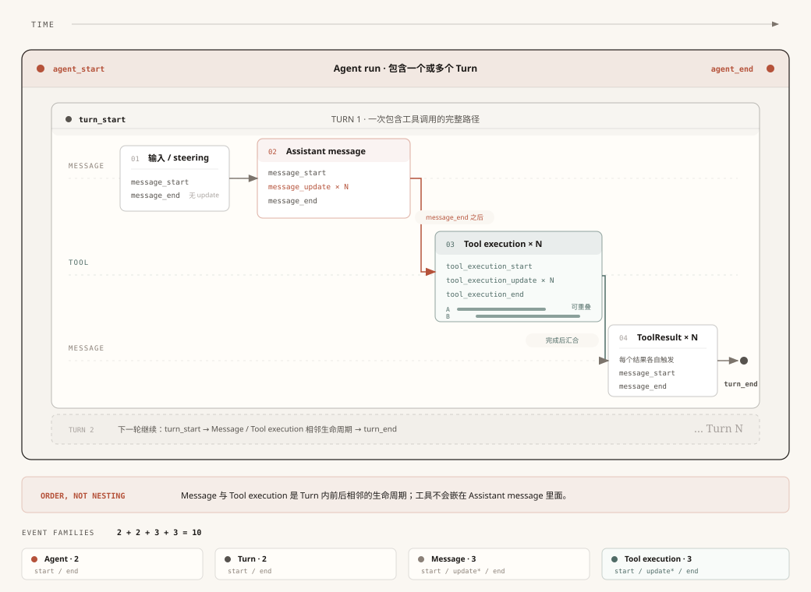
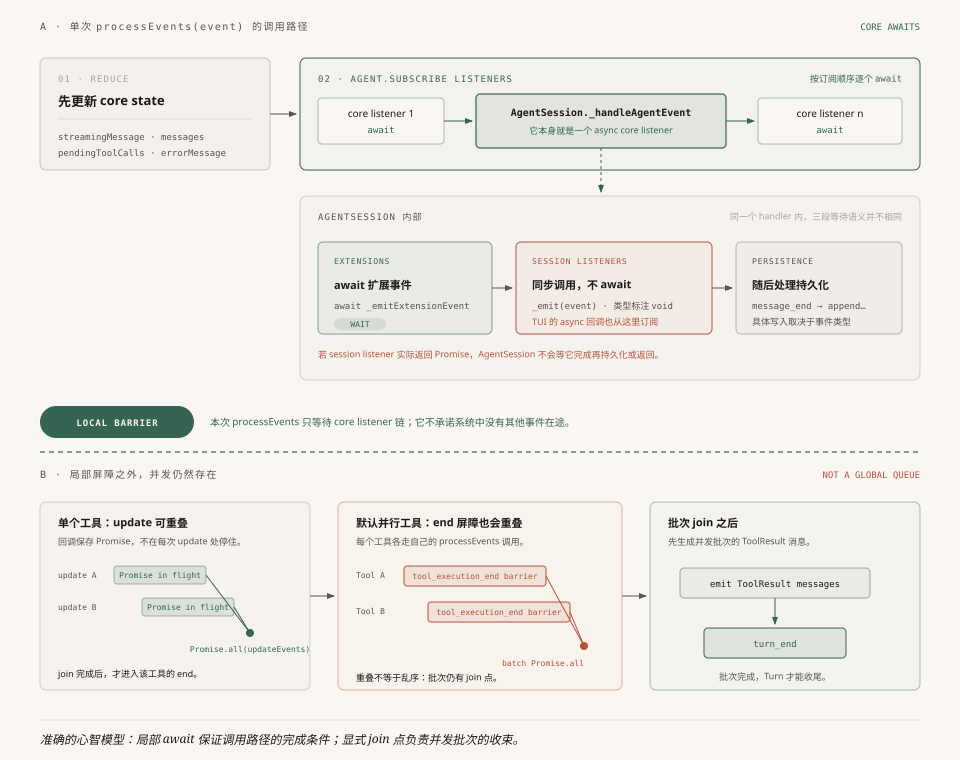
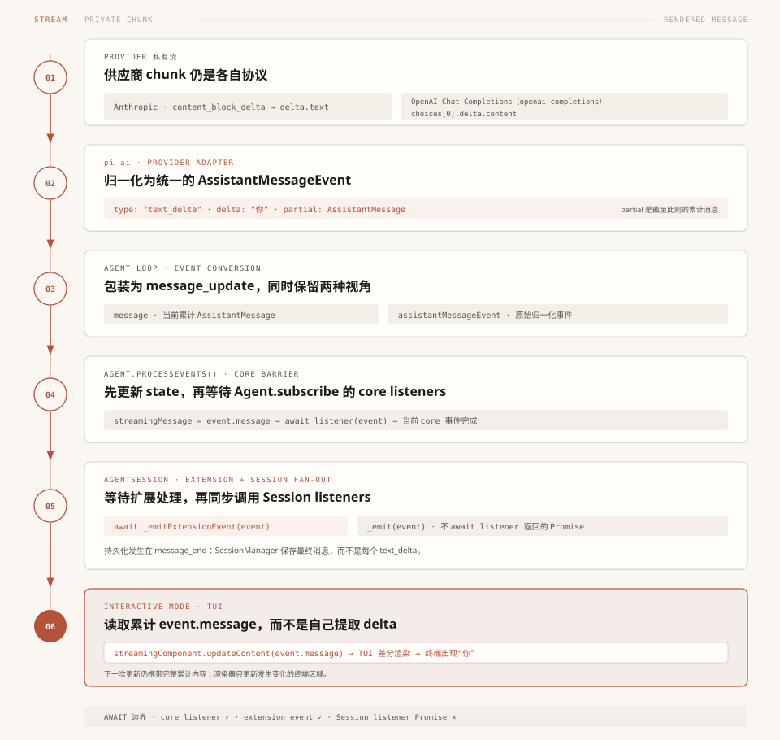

# 第7章：事件驱动 —— Agent 的神经系统

> **Python 阅读说明**：本版与 TypeScript 版共享同一份事实与正文结构。下列 Python 代码只用于解释 TypeScript 源码的控制流，并非可安装的 Pi Python SDK；字段名和类型以链接的 v0.80.2 TypeScript 源码为准。

前六章里，有一个东西反复出现但我们始终没深入——**事件**。

第 3 章说"Agent Loop 每做一步都发事件让 UI 实时更新"。第 5 章说"工具执行时发出 `tool_execution_start`、`tool_execution_update`、`tool_execution_end` 事件"。第 6 章里事件到处携带 `AgentMessage`。

但我们始终没回答：事件到底是怎么从 Agent 内部传到外部的？谁在监听？为什么 agent-core 发完事件后会等待自己的监听器？这个等待又会不会一路覆盖到 AgentSession 和 TUI？

这一章就打开 Agent 的"神经系统"。

> 本章起为进阶章节。前六章建立了对 Pi-Agent 运行机制的整体理解，从这里开始深入工程化议题。
>
> **校对口径**：本章对应 Pi **v0.80.2** 的 [`agent-loop.ts`](https://github.com/earendil-works/pi/blob/0201806adfa825ab3d7957a4267d46e5030fd357/packages/agent/src/agent-loop.ts) 与 [`agent.ts`](https://github.com/earendil-works/pi/blob/0201806adfa825ab3d7957a4267d46e5030fd357/packages/agent/src/agent.ts)。每次 `Agent.processEvents()` 都会按订阅顺序 `await` agent-core 监听器，但这不是一条全局串行事件队列：高频 `tool_execution_update` 可以并发在途，并行工具各自的 `tool_execution_end` 屏障也可能重叠；`AgentSession.subscribe()` 的监听器则不会被 await。

---

## 一、为什么需要事件系统？

### 一个直觉：从外卖追踪说起

你在美团上点了一份外卖。下单后，App 会给你推送一连串状态更新："商家已接单" → "骑手已取餐" → "骑手距你 500 米" → "已送达"。每一个状态更新就是一个**事件**——它告诉你"发生了一件事"。你不需要一直盯着骑手的位置看，只需要在收到事件时看一眼。

Pi-Agent 的事件就是这个意思：Agent 运行过程中不断产生"发生了某事"的快照——消息开始了、消息更新了、工具开始执行了——然后把这些快照推给所有关心它的人。

### 不用事件会怎样？

假设你要给 Agent 加一个"工具调用日志"功能：每次调工具时打印一行 `[LOG] 调用了 read，参数：main.ts`。

**不用事件系统**：你得改 Agent 源码，在 `tool.execute()` 前后各加一行 `console.log`。然后 Pi 更新了，你 merge 上游代码时发现冲突——你加的日志和上游新增的逻辑撞在一起了。手动解决冲突，下周又更新，又冲突……

**用事件系统**：

```python
# ============================================================
# 【Python 改写】订阅事件做工具调用日志
# 原文 TS:
#   session.subscribe((event) => {
#       if (event.type === "tool_execution_end") {
#           console.log(`[LOG] 调用了 ${event.toolName}，结果：${event.isError ? "失败" : "成功"}`);
#       }
#   });
# ============================================================

# 概念对照：TS 的箭头函数 → Python 的 lambda 或 def；
# TS 的三元运算符 → Python 的条件表达式

def listener(event):
    if event.type == "tool_execution_end":
        result_str = "失败" if event.is_error else "成功"
        print(f"[LOG] 调用了 {event.tool_name}，结果：{result_str}")

session.subscribe(listener)
```

六行代码。不碰 Agent 一行源码。Agent 更新你只需要 `npm update`，日志逻辑不受影响。

这就是事件驱动最核心的价值：**把"发生了什么"和"谁关心什么"彻底分离。** Agent 只管发事件，它不知道也不关心谁在听。

> 这里示例使用的是产品层的 `session.subscribe()`。它适合观测事件，但监听器类型返回 `void`，AgentSession 不会等待异步回调完成。agent-core 的 `agent.subscribe()` 是另一套接口，后文讲的可等待屏障只直接约束后者。

### 发布-订阅 vs 直接调用

用编程术语说，事件驱动实现的是**发布-订阅模式**。和直接函数调用做个对比：

```
直接调用（打电话）：
  Agent ──调用──→ 终端渲染
       ──调用──→ 文件存储
       ──调用──→ 日志记录
  Agent 需要知道所有消费者的存在，每加一个新功能就要改 Agent

发布-订阅（广播）：
  Agent ──emit事件──→ 📡 事件总线
                          ├──→ 终端渲染（订阅了）
                          ├──→ 文件存储（订阅了）
                          ├──→ 日志记录（订阅了）
                          └──→ （新功能只需订阅，Agent 不需要知道）
```

一句话：**直接调用是"我亲自找你"；发布-订阅是"我对着空气喊了一声，谁听到算谁的"。** 在 Pi 里，"对着空气喊"就是 `emit(event)`，"谁听到算谁的"就是 `subscribe(listener)`。

---

## 二、10 种事件，4 组生命周期

Agent 内核层定义了 10 种 `AgentEvent`，它们构成了 Agent 运行的完整"脉搏"：



**配图说明**：Agent 包住多个 Turn；每个 Turn 内按时间依次出现消息生命周期和工具执行生命周期。AssistantMessage 的 `message_end` 先发生，之后才会开始工具执行；工具结束后还会为 ToolResultMessage 发出 `message_start` / `message_end`。因此 Message 与 Tool Execution 是 Turn 内相邻的两组生命周期，不是四层套盒。四组事件数仍是 2+2+3+3=10 种。

```python
# ============================================================
# 【Python 改写】AgentEvent 联合类型（10 种）
# 原文 TS:
#   export type AgentEvent =
#     // 第1组：Agent 生命周期（整个运行）
#     | { type: "agent_start" }
#     | { type: "agent_end"; messages: AgentMessage[] }
#     // 第2组：Turn 生命周期（一轮模型调用 + 工具执行）
#     | { type: "turn_start" }
#     | { type: "turn_end"; message: AgentMessage; toolResults: ToolResultMessage[] }
#     // 第3组：Message 生命周期（一条消息）
#     | { type: "message_start"; message: AgentMessage }
#     | { type: "message_update"; message: AgentMessage; assistantMessageEvent: AssistantMessageEvent }
#     | { type: "message_end"; message: AgentMessage }
#     // 第4组：Tool Execution 生命周期（一次工具执行）
#     | { type: "tool_execution_start"; toolCallId: string; toolName: string; args: any }
#     | { type: "tool_execution_update"; toolCallId: string; toolName: string; args: any; partialResult: any }
#     | { type: "tool_execution_end"; toolCallId: string; toolName: string; result: any; isError: boolean };
# ============================================================

# 概念对照：TS 的 tagged union `| { type: "X", ... }` → Python 用 dataclass + 共同 type 字段，
# 或 pydantic 的 discriminated union。这里用 dict + Literal["type"] 简化表达。

# 4 组生命周期、10 种事件：
AgentEvent = Union[
    # 第 1 组：Agent 生命周期（整个运行）
    {"type": Literal["agent_start"]},
    {"type": Literal["agent_end"],       "messages": list[AgentMessage]},

    # 第 2 组：Turn 生命周期（一轮模型调用 + 工具执行）
    {"type": Literal["turn_start"]},
    {"type": Literal["turn_end"],        "message": AgentMessage, "tool_results": list[ToolResultMessage]},

    # 第 3 组：Message 生命周期（一条消息）
    {"type": Literal["message_start"],   "message": AgentMessage},
    {"type": Literal["message_update"],  "message": AgentMessage, "assistant_message_event": AssistantMessageEvent},
    {"type": Literal["message_end"],     "message": AgentMessage},

    # 第 4 组：Tool Execution 生命周期（一次工具执行）
    {"type": Literal["tool_execution_start"],  "tool_call_id": str, "tool_name": str, "args": Any},
    {"type": Literal["tool_execution_update"], "tool_call_id": str, "tool_name": str, "args": Any, "partial_result": Any},
    {"type": Literal["tool_execution_end"],    "tool_call_id": str, "tool_name": str, "result": Any, "is_error": bool},
]
```

10 种看着不少，但规律很清楚——它们是 **4 组生命周期事件**：agent 与 turn 有开始/结束事件，message 与 tool execution 还带零到多个 update。层级关系只有外层的 Agent → Turn；在一个 Turn 里面，消息和工具执行按时间相邻：

```
Agent 运行（agent_start → agent_end）
├── agent_start ───────────────────── Agent 开始
│
├── Turn 1（第3章讲过：一次模型调用 + 它触发的工具执行）
│   ├── turn_start ────────────────── Turn 开始
│   │
│   ├── User / steering Message（如本轮有待投递消息）
│   │   └── message_start → message_end
│   │
│   ├── Assistant Message（完整结束后才执行工具）
│   │   └── message_start → message_update ×N → message_end
│   │
│   ├── Tool Execution ×N（可能并行）
│   │   └── tool_execution_start → tool_execution_update ×N → tool_execution_end
│   │
│   ├── ToolResult Message ×N
│   │   └── message_start → message_end
│   │
│   └── turn_end ──────────────────── Turn 结束
│
├── Turn 2 ...
│
└── agent_end ──────────────────────── Agent 结束
```

回忆第 3 章的概念：**一个 Turn = 一次模型调用 + 这次调用触发的所有工具执行。** turn_start 到 turn_end 之间，模型被调用了恰好一次。

**为什么要 4 组？** 因为不同消费者关心不同粒度。TUI 可用 `message_update` 渲染流式内容；AgentSession 则在 `message_end` 处理持久化，并继续处理 turn / agent 生命周期。分组事件让消费者选择所需粒度，而不是把所有状态塞进一种通知。

---

## 三、每次 core emit 都是可等待屏障

认识了 10 种事件后，来看怎么发出它们。这一节包含 Pi 事件系统最重要的设计决策。



**配图说明**：上半部分画 agent-core 的局部屏障，并展开其中的 AgentSession listener：`Agent.processEvents()` 按订阅顺序等待 core listener；AgentSession 会等待扩展处理，却只同步调用产品层 listener，不等待其 Promise。下半部分只画并发与汇合：工具 update、并行工具的 end 屏障可以重叠，但各自仍有明确 join 点。因此“可等待”描述的是一次 core emit 的调用路径，不是全局串行队列。

### 单条控制路径会 await emit

事件是在 Agent Loop 里发出的。发出动作本身是一个函数——名叫 `emit`。看它的类型定义：

```python
# ============================================================
# 【Python 改写】AgentEventSink 类型定义（emit 的签名）
# 原文 TS: export type AgentEventSink = (event: AgentEvent) => Promise<void> | void;
# ============================================================

# 概念对照：TS 的 `(arg) => Promise<void> | void` → Python 的 Callable[..., Awaitable[None]]
import asyncio
from typing import Callable, Awaitable, Union

AgentEventSink = Callable[[AgentEvent], Union[Awaitable[None], None]]
# 注意返回值——可以是协程（asyncio.Future）。emit 可以是异步的。
```

注意返回值——`Promise<void> | void`。emit 可以同步返回，也可以异步完成。

如果你写过 Node.js 的 `EventEmitter`，你熟悉的 emit 会同步调用普通监听器，但不会等待监听器返回的 Promise。Pi 的 Agent Loop 对大多数生命周期边界则显式使用 `await`：

```python
# ============================================================
# 【Python 改写】Agent Loop 的生命周期 emit 会 await
# 原文 TS:
#   await emit({ type: "agent_start" });
#   await emit({ type: "turn_start" });
#   await emit({ type: "message_start", ... });
#   await emit({ type: "message_update", ... });
#   await emit({ type: "message_end", ... });
# ============================================================

import inspect

async def call_maybe_async(fn, *args):
    # TypeScript 可以 await void；Python 不能 await None，所以先判断返回值。
    result = fn(*args)
    if inspect.isawaitable(result):
        await result

async def emit_lifecycle(emit, message):
    await call_maybe_async(emit, {"type": "agent_start"})
    await call_maybe_async(emit, {"type": "turn_start"})
    await call_maybe_async(emit, {"type": "message_start", "message": message})
    await call_maybe_async(emit, {"type": "message_update", "message": message})
    await call_maybe_async(emit, {"type": "message_end", "message": message})
```

这些 `await` 都在说：**“在当前这条控制路径上，等这次 emit 返回，再进入下一阶段。”**

这跟完全忽略返回 Promise 的发布订阅不同。但它不等于“全局只有一条事件队列”：高频工具进度和并行工具会产生重叠，稍后单独讨论。

为什么？接下来解释。

### processEvents：先更新状态，再等监听器

`emit` 的实体是 Agent 类的 `processEvents` 方法，做了三件事：

```python
# ============================================================
# 【Python 改写】Agent.process_events（core 可等待屏障实现）
# 原文 TS:
#   private async processEvents(event: AgentEvent): Promise<void> {
#       switch (event.type) {
#           case "message_start":
#               this._state.streamingMessage = event.message;   break;
#           case "message_update":
#               this._state.streamingMessage = event.message;   break;
#           case "message_end":
#               this._state.streamingMessage = undefined;
#               this._state.messages.push(event.message);       break;
#       }
#       const signal = this.activeRun?.abortController.signal;
#       // 第三步：等待 agent-core 监听器完成
#       for (const listener of this.listeners) {
#           await listener(event, signal);
#       }
#   }
# ============================================================

async def process_events(self, event: AgentEvent) -> None:
    # 第一步：根据事件类型更新内部状态
    if event["type"] == "message_start":
        self._state.streaming_message = event["message"]    # 开始追踪流式消息
    elif event["type"] == "message_update":
        self._state.streaming_message = event["message"]    # 更新流式消息内容
    elif event["type"] == "message_end":
        self._state.streaming_message = None                # 清空临时工位
        self._state.messages.append(event["message"])       # 搬入正式档案
    # ... tool_execution_start/end 更新 pending_tool_calls 等

    # 第二步：拿 AbortSignal
    signal = self.active_run.abort_controller.signal if self.active_run else None

    # 第三步：等待 agent-core 监听器完成
    for listener in self.listeners:
        await call_maybe_async(listener, event, signal)    # ← 一个一个等！
```

关键在第三步：**Agent 按订阅顺序，逐一 await 所有监听器。**

你可能会问：这跟"在循环里直接调用函数"有什么区别？区别在于 **Agent 的 `this.listeners` 是一个外部的 Set，它不知道里面是谁。** Agent 只负责"遍历并等待"，而谁在 Set 里、谁不在，完全由外部通过 `subscribe()` 控制。Agent 内核代码里没有任何一行 `updateTerminal()` 或 `appendToFile()`——它甚至不知道 TUI 和文件存储的存在。

### 这个 await 保证什么？

假设不 await，看看会发生什么：

```
假设 emit 是 fire-and-forget（不等待）：

Agent Loop:     emit(start)  emit(update)  emit(end)
                ↓             ↓              ↓
core listener: [开始处理...]  [还没处理完    [三个调用堆在一起了]
                                 start...]

问题：listener 还没处理完 start，update 就进入同一消费者。
      消费者若依赖顺序，就必须自行排队。
```

```
同一条串行控制路径（await，可等待屏障）：

Agent Loop:
  emit(start) ──await──→
  emit(update) ──await──→
  emit(end) ──await──→

core listener:
  [处理完毕，返回] → [处理完毕，返回] → [处理完毕，返回]

保证：这条控制路径在监听器返回前不会越过当前 emit。
```

一句话总结：**对一次 `Agent.processEvents()` 调用，`await` 把“已调用 core listener”提升为“这组 core listener 已经处理完”。** 这就是这里所说的可等待屏障。

代价是这条控制路径的延迟会受最慢 core listener 影响；收益是它的下一个阶段不会越过尚未处理完的事件。

### 两种并发：工具 update 与并行工具 end

如果每个事件都要 await，那 `tool_execution_update` 呢？工具执行过程中可能产生高频增量（例如 Bash 的流式输出块），每次都 await 不会太慢吗？

确实，Pi 对这种高频事件做了特殊处理——**先收集、后批量等待**：

```python
# ============================================================
# 【Python 改写】tool_execution_update 的批量收集策略
# 原文 TS:
#   const updateEvents: Promise<void>[] = [];
#   let acceptingUpdates = true;
#   const result = await tool.execute(id, args, signal, (partialResult) => {
#       if (!acceptingUpdates) return;
#       updateEvents.push(emit({ type: "tool_execution_update", ... }));
#   });
#   acceptingUpdates = false;
#   await Promise.all(updateEvents);
# ============================================================

# 概念对照：TS 的 Promise<T>[] → Python 的 list[Awaitable[T]]；
# TS 的 Promise.all → Python 的 asyncio.gather

async def execute_with_updates(tool, tool_call_id, args, signal, emit):
    update_events: list[Awaitable[None]] = []        # 收集箱
    state = {"accepting_updates": True}

    def on_partial(partial_result):
        if not state["accepting_updates"]:
            return                                   # 工具已结束，丢弃迟到 update
        # create_task 让多个 emit 并发在途；稍后统一等待
        update_events.append(asyncio.create_task(emit({
            "type": "tool_execution_update",
            "partial_result": partial_result,
        })))

    result = await tool.execute(tool_call_id, args, signal, on_partial)
    state["accepting_updates"] = False                # 关闭闸门
    await asyncio.gather(*update_events)              # 等所有在途 update 处理完
    return result
```

这些 update Promise 在回调里一创建就开始执行，因此彼此可能重叠；代码没有合并或主动丢弃已经接收的 update。屏障被移动到单个工具 settle 之后：这个工具的 `tool_execution_end` 之前必须等它的全部在途 update 完成。

还有一个设计细节：`acceptingUpdates` 闸门。工具的 `execute` 是 async 函数，它内部的进度回调可能在 Promise resolve 之后还异步触发（残留定时器/延迟回调）。没有这道闸门，迟到的 `partialResult` 会在 `tool_execution_end` 之后又发出 `tool_execution_update`，让监听器看到"工具已经结束了却还在更新"的错乱序列。

默认工具策略是并行。多个已准备好的工具会一起进入 `Promise.all`，每个工具完成后独立 `await emitToolExecutionEnd(...)`。因此，**不同工具的 `tool_execution_end` 监听工作也可能彼此重叠**。整批工具完成后，Loop 才按原顺序发 ToolResultMessage，最后发 `turn_end`。

所以准确模型不是“除 update 外所有事件全局串行”，而是：**每次 emit 都能成为其调用者的局部屏障；Turn 的关键阶段有批次级汇合点。**

### AgentSession.subscribe 不继承异步屏障

coding-agent 的 AgentSession 自己是 `Agent.subscribe()` 的一个异步 listener，所以 agent-core 会等待 `_handleAgentEvent()`。但 `_handleAgentEvent()` 再向产品层分发时，调用的是同步 `_emit()`：

```text
export type AgentSessionEventListener = (event: AgentSessionEvent) => void;

private _emit(event: AgentSessionEvent): void {
    for (const listener of this._eventListeners) {
        listener(event); // 返回的 Promise 不会被 await
    }
}
```

这意味着 `session.subscribe(async (event) => { ... })` 虽然能写，但它的异步完成不属于 agent-core 的屏障。同步回调抛错仍会沿 `_handleAgentEvent()` 冒泡；异步回调 reject 则不会被 Session 等待。产品层若需要严格顺序，应在自己的 listener 内排队，不能借用 core 屏障做假设。

---

## 四、错误处理：监听器异常直接冒泡

`processEvents` 的监听器循环有一个容易忽略的细节：**没有 try-catch。**

```python
# ============================================================
# 【Python 改写】监听器循环没有 try-except
# 原文 TS:
#   for (const listener of this.listeners) {
#       await listener(event, signal);
#   }
# ============================================================

for listener in self.listeners:
    await listener(event, signal)   # 没有 try-except！
```

如果某个 **agent-core listener** 抛异常或返回 rejected Promise，异常会冒泡到 `runWithLifecycle`，当前 run 会进入失败处理。Agent 对象并非因此永久不可用。AgentSession 的同步 listener 抛错也会经 `_handleAgentEvent()` 走到这里；但 Session listener 返回的 Promise 不受等待，不能套用同一结论。

源码没有在这里注释“为什么”，可以确定的是行为取舍：core listener 错误不会被该循环降级成普通通知，而会让当前 run 进入失败处理。这提高了故障可见性，也意味着 core 订阅者属于运行的可靠性边界。

**实践建议**：如果你直接订阅 Agent，listener 应自行处理预期错误；如果你订阅 AgentSession，还要避免把异步顺序保证寄托在返回的 Promise 上。

coding-agent 的扩展 runner 另有一层事件策略：多数扩展事件会逐 handler catch 并上报 `ExtensionError`，某些会影响控制流的钩子则走各自的错误路径。不要把扩展 runner 的隔离策略等同于 agent-core 的 `subscribe()` 语义。

---

## 五、你能用事件系统做什么？

前面讲的是"机制"。理解了机制之后，真正的问题是：**你能用这套事件系统做什么？**

下面是几个代表性场景：

### 场景1：实时观测 Agent 在干什么

```python
# ============================================================
# 【Python 改写】订阅事件做实时观测
# 原文 TS:
#   session.subscribe((event) => {
#       if (event.type === "tool_execution_start") {
#           console.log(`🔧 ${event.toolName}(${JSON.stringify(event.args).slice(0, 50)})`);
#       }
#       if (event.type === "tool_execution_end") {
#           console.log(`   └─ ${event.isError ? "❌ 失败" : "✅ 成功"}`);
#       }
#   });
# ============================================================

import json

def listener(event):
    if event["type"] == "tool_execution_start":
        args_str = json.dumps(event["args"])[:50]
        print(f"🔧 {event['tool_name']}({args_str})")
    if event["type"] == "tool_execution_end":
        result_str = "❌ 失败" if event["is_error"] else "✅ 成功"
        print(f"   └─ {result_str}")

session.subscribe(listener)
```

Pi 的 TUI 通过订阅会话事件更新主要运行视图；启动流程、编辑器交互等还各有直接的 UI 控制路径，所以不应把终端里的每一个字符都归因于 AgentEvent。

### 场景2：工具调用拦截

通过扩展系统的 `tool_call` 事件，扩展可以返回 `{ block: true, reason: "生产环境禁止删除操作" }`，工具就不会被执行。第 5 章讲的五步管道中第 3 步 `beforeToolCall`，就是由这个机制实现的。

### 场景3：上下文预处理

扩展可以在 LLM 调用之前修改消息列表——例如注入当前时间、Git 状态，或过滤某类临时上下文。这是第 6 章讲的 `transformContext` 钩子的实现方式；内置 Compaction 不是由这个钩子完成的。

### 场景4：流式转发到 Web 前端

```python
# ============================================================
# 【Python 改写】订阅事件流转到 Web 前端（SSE）
# 原文 TS:
#   // 服务端
#   const unsubscribe = session.subscribe((event) => {
#       if (
#           event.type === "message_update" &&
#           event.assistantMessageEvent.type === "text_delta"
#       ) {
#           const text = event.assistantMessageEvent.delta;
#           res.write(`data: ${JSON.stringify({ type: "delta", text })}\n\n`);
#       }
#   });
#
#   try {
#       // prompt() 会等待自动重试、自动压缩及其触发的 continue() 全部结束
#       await session.prompt(userInput);
#   } finally {
#       unsubscribe();
#       res.end();
#   }
# ============================================================

import json

def listener(event):
    if event["type"] == "message_update":
        assistant_event = event["assistantMessageEvent"]
        if assistant_event["type"] == "text_delta":
            payload = {"type": "delta", "text": assistant_event["delta"]}
            res.write(f"data: {json.dumps(payload)}\n\n")

unsubscribe = session.subscribe(listener)
try:
    # prompt() 会等待自动重试、自动压缩及其触发的 continue() 全部结束
    await session.prompt(user_input)
finally:
    unsubscribe()
    res.end()
```

Agent 运行在服务器上，用户通过浏览器访问。这里把归一化后的 `text_delta` 逐段推给浏览器，前端可以安全 append；如果改为发送累计的 `event.message`，前端就必须采用 replace 语义，否则会重复内容。不要在单次 `agent_end` 上关闭 SSE：该事件之后仍可能发生供应商错误自动重试、自动 Compaction，或由扩展新排队消息触发的 `continue()`。等待 `session.prompt()` 整体返回，才表示这次会话级运行真正收尾。

### 小结

这些场景都可以在不修改 Agent Loop 的前提下完成，但入口不同：观测、转发类功能适合 `subscribe()`；拦截工具和修改上下文属于 coding-agent 的扩展事件与钩子。事件流负责暴露运行状态，控制型扩展则通过显式返回值影响后续流程。

---

## 六、案例：追踪一个 text_delta 的完整旅程

把前面学到的知识串起来，追踪一个 `text_delta` 事件——从 LLM 流式返回的一个文本片段，到你的终端屏幕。



**配图说明**：六站数据流——Provider 私有 chunk → pi-ai 归一化 `text_delta` → Agent Loop 包装为 `message_update` → `Agent.processEvents()` 的 core 屏障 → AgentSession 同步分发 → TUI 读取累计的 `event.message` 并差分渲染。Session 会被 core 等到 `_handleAgentEvent()` 返回，但不会继续等待产品层异步 listener。

假设 LLM 正在生成“你好”两个字，其中携带“你”的一个文本片段从 Provider 私有流到终端显示，会经过以下六个站点：

```
触发端：Provider 私有流式响应
  │  Anthropic: content_block_delta + delta.text
  │  OpenAI Chat Completions（openai-completions）: choices[0].delta.content
  │
  ▼ 中转1：pi-ai Provider 适配器 + EventStream.push()
  │  解析私有 chunk，归一化为
  │  AssistantMessageEvent { type: "text_delta", delta: "你", partial: ... }
  │  （第 4 章讲过的 12 种 pi-ai 流事件之一）
  │
  ▼ 中转2：Agent Loop 事件转换
  │  AI 层 text_delta → Agent 层 message_update
  │  原始事件通过 assistantMessageEvent 字段透传
  │
  ▼ 中转3：Agent.processEvents()（core 可等待屏障）
  │  更新 streamingMessage 内部状态
  │  await Agent.subscribe() listeners
  │
  ▼ 中转4：AgentSession._handleAgentEvent()
  │  await 扩展系统 → 同步调用 Session 监听器 → 持久化
  │  （不等待 Session listener 返回的 Promise）
  │
  ▼ 终点：TUI 监听器
  │  读取累计的 event.message
  │  → streamingComponent.updateContent(message) → 差分渲染
  │
  ▼
你看到了 "你" 字出现
```

整条链路上，每一层各有职责：AI 层解析 Provider 流并构建消息；Agent Loop 产出运行事件并处理工具；Agent 更新状态并等待 core listener；Session 把底层事件扩展成产品事件并负责持久化；TUI 消费这些事件渲染界面。相邻层仍通过明确的方法调用协作，**事件是运行状态向外传播的主协议，不是层间唯一的调用方式。**

这里有一个关键的数据变换值得注意：**AI 层的内容开始、增量与结束事件**（如 `text_start` / `text_delta` / `text_end`，以及 thinking、toolcall 对应事件）都会映射为 Agent 层的 `message_update`。归一化后的 AI 事件通过 `assistantMessageEvent` 字段附在 `message_update` 上透传。Agent Loop 只关心“消息更新了”，消费者若需要细粒度信息仍可读取它。Pi 的交互 TUI 在 v0.80.2 中没有提取 delta，而是用累计的 `event.message` 更新组件。

---

## 七、Session 层扩展了什么

前六节讲的是 Agent 内核的事件系统——10 种事件。但 Pi 不只有 Agent 层，上面还有一层 `AgentSession`（产品会话层）。

AgentSession 需要处理的事比 Agent 内核多得多：上下文压缩、自动重试、队列状态管理……这些概念在 Agent 内核里不存在。就像你在 Linux 内核里找不到"蓝牙已连接"的通知——内核只管进程调度和内存管理，蓝牙是上层的事。

### 内核 10 种 + Session 7 种

AgentSession 用联合类型扩展了事件：

```
AgentSessionEvent =
    基础 10 种（agent_end 被重载，增加 willRetry 字段）
  + Session 新增 7 种：
      queue_update           ← steering/followUp 队列变化
      compaction_start/end   ← 上下文压缩（第9章详讲）
      auto_retry_start/end   ← LLM 调用失败自动重试
      session_info_changed   ← 会话名称变更
      thinking_level_changed ← 思考深度切换
```

这些事件只和"产品级体验"有关，和"Agent 内核逻辑"无关。所以它们被放在了 Session 层而不是 Agent 层。

**这就是"两层事件"的设计思路：内核只管内核的事（生命周期），产品在上面按需扩展（用户体验）。** 判断标准很简单：如果去掉某个事件后内核还能正常运行，它就属于外层。

---

## 八、总结：三个设计决策

### 决策1：局部可等待屏障

`processEvents` 按订阅顺序 await agent-core 监听器，使单次 emit 成为调用者的明确边界。单个工具的 `tool_execution_update` 可并发在途，但必须在该工具终态事件前全部 settle；并行工具各自的终态屏障仍可能重叠。AgentSession listener 的 Promise 不在这个保证内。

### 决策2：异常直接暴露

agent-core 的监听器循环不加 try-catch：监听器出错会让当前 run 进入失败处理。coding-agent 扩展事件是另一套边界，应按具体 handler 路径判断。

### 决策3：两层事件

Agent 内核只定义 4 组生命周期的 10 种事件。Session 层用联合类型扩展 7 种产品级事件。如果去掉某个事件后内核还能正常运行，它就属于外层。

---

## 九、下一站

本章我们看到，事件系统是 Agent 运行状态向 UI、持久化和扩展传播的主通道。各层仍会通过直接方法调用完成命令、状态修改和存储操作，因此这里是职责解耦，不是“所有协作都只靠事件”。

但有一个和事件密切相关的机制我们只提了一句：**上下文维护**。`transformContext` 在每次 `convertToLlm` 之前运行，适合过滤或注入请求级上下文；coding-agent 的内置 Compaction 则由 AgentSession 在一次 Agent run 结束后检查阈值、生成摘要、写入 Session Tree，再替换 `agent.state.messages`。两者都影响下一次模型调用，却不在同一条钩子里完成。

接下来两章我们就打开 Pi 的上下文工程全貌。第 8 章先讲全景——从输入侧的工具输出截断、系统提示词组装，到历史侧的 Compaction 与分支摘要，让你看清 Pi 在多个环节布置的防线；第 9 章再深入其中最核心的压缩算法（Compaction），看 Pi 怎么在上下文窗口快满时把一段很长的对话压缩成结构化摘要，让 Agent 继续"记住"之前发生了什么。

---

> **本章关键源码索引**：
> - `packages/agent/src/types.ts:413-428` — 10 种 `AgentEvent` 定义
> - `packages/agent/src/agent-loop.ts:25` — `AgentEventSink` 类型（emit 签名）
> - `packages/agent/src/agent.ts:509-556` — `processEvents`（core 可等待屏障实现）
> - `packages/agent/src/agent.ts:168,231-233` — `subscribe` 和 `listeners`
> - `packages/coding-agent/src/core/agent-session.ts:151-152,468-473,691-700` — Session listener 不返回/等待 Promise
> - `packages/agent/src/agent-loop.ts:628-669` — `executePreparedToolCall`（update 特殊处理）
> - `packages/agent/src/agent-loop.ts:451-504` — 并行工具与可重叠的 tool_execution_end 屏障
> - `packages/coding-agent/src/core/agent-session.ts:126-150` — `AgentSessionEvent`（17 种事件）
